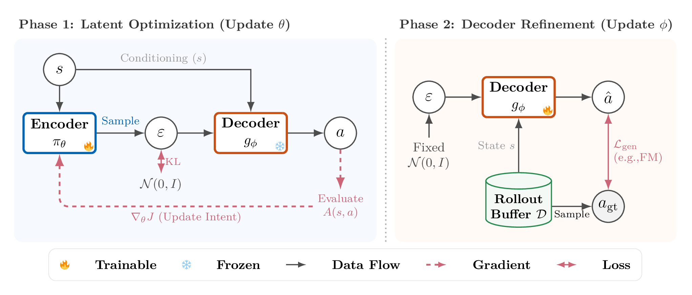
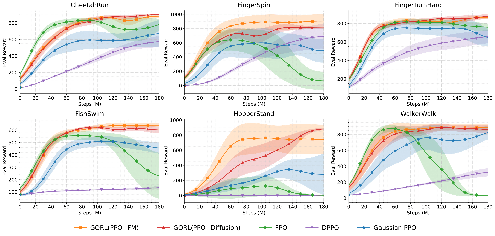

# GoRL: Generative Online Reinforcement Learning

*Chubin Zhang\*<sup>1</sup>, Zhenglin Wan\*<sup>2</sup>, Feng Chen<sup>1</sup>,
Fuchao Yang<sup>1</sup>, Lang Feng<sup>1</sup>, Yaxin Zhou<sup>3</sup>,
Xingrui Yu<sup>4,5</sup>, Yang You<sup>2</sup>, Ivor Tsang<sup>1,4,5</sup>, Bo An<sup>1</sup>*

<sup>1</sup> Nanyang Technological University · <sup>2</sup> National University of Singapore ·
<sup>3</sup> Carnegie Mellon University<br>
<sup>4</sup> CFAR, A\*STAR · <sup>5</sup> IHPC, A\*STAR

(\*: Equal contribution)

<p align="center">
  <a href="https://arxiv.org/abs/2512.02581">
    </a>
  &nbsp;
  <a href="https://proceedings.mlr.press/v306/zhang26fu.html">
    </a>
  &nbsp;
  <a href="https://github.com/bennidict23/GoRL">
    </a>
  &nbsp;
  <a href="./src/gorl/LICENSE">
    </a>
</p>

> 🎉 **GoRL has been accepted to ICML 2026!**

**GoRL (Generative Online Reinforcement Learning)** separates tractable latent
policy optimization from expressive flow-matching and diffusion action generation.

## 📖 Table of Contents

- [Key Features](#-key-features)
- [Method](#-method)
- [Installation](#%EF%B8%8F-installation)
- [Usage](#-usage)
- [Configuration](#%EF%B8%8F-configuration)
- [Directory Structure](#-directory-structure)
- [Results](#-results)
- [Acknowledgement](#-acknowledgement)
- [Citation](#-citation)
- [License](#-license)

## ✨ Key Features

| Feature | Description |
| --- | --- |
| **Latent optimization** | PPO updates a tractable latent policy rather than the generative sampling chain. |
| **Generative policies** | Both flow-matching and diffusion decoders are supported. |
| **Alternating training** | Latent policy optimization alternates with fixed-prior decoder refinement. |
| **Eight control tasks** | Six DMControl tasks plus HumanoidStand and HumanoidRun, with PPO, FPO, and DPPO baselines. |

## 🧠 Method

GoRL separates a generative policy into a PPO-trained latent encoder and a
flow-matching or diffusion action decoder:

$$\pi(a\mid s) = \int p_\phi(a\mid s,z)\,\pi_\theta(z\mid s)\,\mathrm{d}z$$

<p align="center">
  
</p>

- **Encoder** $\pi_\theta(z\mid s)$: a tractable latent policy optimized with PPO.
- **Decoder** $g_\phi(s,z)$: a flow-matching or diffusion model that maps latent decisions to actions.

Training alternates between collecting policy data, fitting the decoder, and
optimizing the encoder with the decoder frozen. The six standard tasks start
with an identity decoder. Humanoid tasks first train a fresh Brax PPO teacher.
No pretrained checkpoint or dataset is required.

## 🛠️ Installation

Tested on Linux with Python 3.12 and NVIDIA CUDA 12.

```bash
git clone https://github.com/bennidict23/GoRL.git
cd GoRL
unset PYTHONPATH PYTHONHOME
export PYTHONNOUSERSITE=1
conda create -n gorl python=3.12 pip=25.0.1
conda activate gorl
python -m pip install -r requirements.txt
export XLA_PYTHON_CLIENT_PREALLOCATE=false
export MUJOCO_GL=egl
```

Run a small training experiment:

```bash
CUDA_VISIBLE_DEVICES=0 gorl train --task CheetahRun --method gorl_fm --seed 1 --smoke
```

The first run compiles JAX kernels and may be quiet for several minutes.
`--smoke` checks execution, not benchmark performance.

## 🚀 Usage

### GoRL

Remove `--smoke` to use the full training schedule:

```bash
# Flow matching
CUDA_VISIBLE_DEVICES=0 gorl train --task CheetahRun --method gorl_fm --seed 1

# Diffusion
CUDA_VISIBLE_DEVICES=0 gorl train --task CheetahRun --method gorl_diffusion --seed 1
```

The same command works for every task. Profiles are selected automatically.

| Tasks | GoRL schedule |
| --- | --- |
| CheetahRun, FingerSpin, FingerTurnHard, FishSwim, HopperStand, WalkerWalk | 60M / 60M / 30M / 30M |
| HumanoidStand | 60M / 60M / 30M / 30M |
| HumanoidRun | 60M backbone anchor + 60M / 60M latent stages |

Humanoid GoRL additionally trains its teacher for 180M requested PPO steps
(about 185.79M after update rounding), outside the nominal schedule above.
Humanoid PPO uses Brax; the other PPO tasks use the FPO backend.

### Baselines

Fetch the pinned baseline code once; Git is required:

```bash
gorl-fetch-dependencies --dependency all --destination-root external

CUDA_VISIBLE_DEVICES=0 gorl train --task CheetahRun --method ppo --seed 1
CUDA_VISIBLE_DEVICES=0 gorl train --task CheetahRun --method fpo --seed 1
CUDA_VISIBLE_DEVICES=0 gorl train --task CheetahRun --method dppo --seed 1
```

Baselines use a single 180M-step training budget.

### Outputs and W&B

Runs are saved under `runs/`. Final return is the last evaluation, not the best.

W&B is optional and disabled by default:

```bash
wandb login
gorl train --task CheetahRun --method gorl_fm --seed 1 --wandb-mode online
```

Use `--wandb-mode offline` without an account. Curves stay continuous across stages.

## ⚙️ Configuration

Defaults are in `configs/tasks/` and `configs/methods/`. Use `--config FILE.toml`
for overrides and `gorl train --help` for options. Keep hyperparameters fixed
when comparing seeds. All role seeds default to `--seed`.

To train both Humanoid variants using one freshly trained teacher:

```bash
CUDA_VISIBLE_DEVICES=0,1 gorl train-pair --task HumanoidRun \
  --teacher-seed 1 --fm-seed 1 --diffusion-seed 3 --gpus 0 1
```

Smoke runs are not a full-budget performance guarantee. HumanoidStand Diffusion
can have large decoder-switch drops or non-finite training. Teacher training
and collection consume additional interactions beyond the nominal schedule.
Training-state resume is not supported.

## 📂 Directory Structure

```text
.
├── configs/    Task, method, and dependency settings
├── docs/       Framework and results figures
├── scripts/    Baseline dependency setup
└── src/        GoRL algorithms and baseline adapters
```

## 📊 Results

The original six-task comparison is shown below, with GoRL-FM and
GoRL-Diffusion alongside PPO, FPO, and DPPO. This release also includes
HumanoidStand and HumanoidRun.

<p align="center">
  
</p>

## 🙏 Acknowledgement

GoRL builds on [FPO](https://github.com/akanazawa/fpo),
[Brax](https://github.com/google/brax), and
[MuJoCo Playground](https://github.com/google-deepmind/mujoco_playground).
See [third-party notices](src/gorl/THIRD_PARTY_NOTICES.md).

## 📝 Citation

If you find this code useful, please cite our paper:

```bibtex
@inproceedings{pmlr-v306-zhang26fu,
  title     = {Generative Online Reinforcement Learning},
  author    = {Zhang, Chubin and Wan, Zhenglin and Chen, Feng and Yang, Fuchao and Feng, Lang and Zhou, Yaxin and Yu, Xingrui and You, Yang and Tsang, Ivor and An, Bo},
  booktitle = {Proceedings of the 43rd International Conference on Machine Learning},
  year      = {2026},
  volume    = {306},
  pages     = {158816--158837},
  series    = {Proceedings of Machine Learning Research},
  publisher = {PMLR},
  url       = {https://proceedings.mlr.press/v306/zhang26fu.html}
}
```

## 📄 License

[MIT License](src/gorl/LICENSE).
